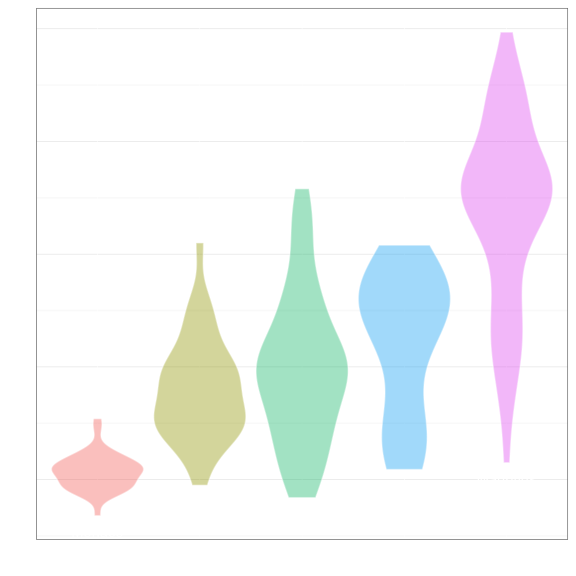

Script that reproduces plots from the chapter ,,Grammar of Graphics''
================
Przemyslaw Biecek
22 December 2015

-   Data preparation
-   Data
-   Layers
-   Mappings
-   Forms / Geoms
    -   Points
    -   Area
    -   Rectangles
    -   Lines
    -   Other geoms
-   Stats
-   Position modifiers
-   Coordinate system
-   Scales
    -   scales\_x
    -   shape
-   Panels / facets
-   Themes

Data preparation
================

``` r
library(archivist)
library(knitr)
library(ggplot2)

# store everything in the archivist repo
addHooksToPrint(class=c("ggplot", "knitr_kable"),
                 repoDir = "arepo", 
                 repo = "Eseje", user = "pbiecek", subdir = "arepo")

library(scales)
library(dplyr)
library(tidyr)
library(gridExtra)
library(rworldmap)
library(ggthemes)
library(latticeExtra)
library(lattice)

q3 <- function(x) {
  a <- quantile(x, c(0.25,0.5,0.75))
  names(a) <- c("ymin", "y", "ymax")
  a
}

opts_chunk$set(comment=NA, fig.width=6, fig.height=6, results='asis', warning=FALSE, message=FALSE, cache=FALSE)
```

Data
====

Here we are using the `SmarterPoland` package and two datasets.

``` r
library(SmarterPoland)
print(kable(head(countries)))
```

Load: [`archivist::aread('pbiecek/Eseje/arepo/a0f2357b814a76a46f2a42e831ea5296')`](https://raw.githubusercontent.com/pbiecek/Eseje/master/arepo/gallery/a0f2357b814a76a46f2a42e831ea5296.rda)

| country             |  birth.rate|  death.rate|  population| continent |
|:--------------------|-----------:|-----------:|-----------:|:----------|
| Afghanistan         |        34.1|         7.7|       30552| Asia      |
| Albania             |        12.9|         9.4|        3173| Europe    |
| Algeria             |        24.3|         5.7|       39208| Africa    |
| Andorra             |         8.9|         8.4|          79| Europe    |
| Angola              |        44.1|        13.9|       21472| Africa    |
| Antigua and Barbuda |        16.5|         6.8|          90| Americas  |

``` r
print(kable(head(maturaExam)))
```

Load: [`archivist::aread('pbiecek/Eseje/arepo/9797e887eb6f35519246f51946388462')`](https://raw.githubusercontent.com/pbiecek/Eseje/master/arepo/gallery/9797e887eb6f35519246f51946388462.rda)

|  id\_ucznia|  punkty| przedmiot  | rok  |
|-----------:|-------:|:-----------|:-----|
|           4|      14| matematyka | 2011 |
|           4|      31| j. polski  | 2011 |
|           5|      19| matematyka | 2010 |
|           5|      35| j. polski  | 2010 |
|           7|      16| matematyka | 2010 |
|           7|      43| j. polski  | 2010 |

Layers
======

``` r
countriesMin <- countries %>% 
  group_by(continent) %>% 
  filter(birth.rate == min(birth.rate, na.rm=TRUE))
countriesMax <- countries %>% 
  group_by(continent) %>% 
  filter(birth.rate == max(birth.rate, na.rm=TRUE))
  
theme_ggplain <- theme_bw() + theme(panel.grid.major.x = element_line(color="white"), axis.ticks=element_line(size=0), axis.text=element_text(size=0))

# foirst example
countries$continent <- reorder(countries$continent, countries$birth.rate, median, na.rm=TRUE)

ggplot(countries, aes(x=continent, y=birth.rate, label=country)) +
  geom_violin(scale="width", aes(fill=continent), color="white", alpha=0.4) + 
  stat_summary(fun.data = "q3", geom = "crossbar",
               colour = "red", width = 0.5) + 
  geom_jitter(aes(size=(population)^0.9),position=position_jitter(width = .45, height = 0),
             shape=15) +
  geom_rug(sides = "l") + 
  geom_text(data=countriesMin, vjust=2, color="blue3") + 
  geom_text(data=countriesMax, vjust=-1, color="blue3") + 
  theme_bw() + xlab("") + theme(legend.position="none", panel.grid.major.x = element_line(color="white"))
```

Load: [`archivist::aread('pbiecek/Eseje/arepo/24ea7c04b861083d4bf56eee1c5a17b7')`](https://raw.githubusercontent.com/pbiecek/Eseje/master/arepo/gallery/24ea7c04b861083d4bf56eee1c5a17b7.rda) <!-- -->

``` r
ggplot(countries, aes(x=continent, y=birth.rate, label=country)) +
  geom_jitter(color="white",size=0) +
  geom_text(data=countriesMin, vjust=2, color="blue3") + 
  geom_text(data=countriesMax, vjust=-1, color="blue3") + 
  theme_bw() + xlab("") + ylab("") + theme_ggplain
```

Load: [`archivist::aread('pbiecek/Eseje/arepo/fb548661c44e22f2027cec7e73ecc300')`](https://raw.githubusercontent.com/pbiecek/Eseje/master/arepo/gallery/fb548661c44e22f2027cec7e73ecc300.rda) <!-- -->

``` r
ggplot(countries, aes(x=continent, y=birth.rate, label=country)) +
  geom_violin(scale="width", aes(fill=continent), color="white", alpha=0.4) + 
  geom_text(data=countriesMin, vjust=2, color="white") + 
  geom_text(data=countriesMax, vjust=-1, color="white") + 
  theme_ggplain + xlab("") + ylab("") +theme(legend.position="none")
```

Load: [`archivist::aread('pbiecek/Eseje/arepo/68707b3bb377d502f99c72d89d7d76db')`](https://raw.githubusercontent.com/pbiecek/Eseje/master/arepo/gallery/68707b3bb377d502f99c72d89d7d76db.rda) <!-- -->

``` r
ggplot(countries, aes(x=continent, y=birth.rate, label=country)) +
  stat_summary(fun.data = "q3", geom = "crossbar",
               colour = "red", width = 0.5) + 
  geom_text(data=countriesMin, vjust=2, color="white") + 
  geom_text(data=countriesMax, vjust=-1, color="white") + 
  theme_ggplain + xlab("") + ylab("") 
```

Load: [`archivist::aread('pbiecek/Eseje/arepo/2307911ba650efb3f02096641d60510b')`](https://raw.githubusercontent.com/pbiecek/Eseje/master/arepo/gallery/2307911ba650efb3f02096641d60510b.rda) <!-- -->

``` r
ggplot(countries, aes(x=continent, y=birth.rate, label=country)) +
  geom_jitter(aes(size=(population)^0.9),position=position_jitter(width = .45, height = 0),
             shape=15) +
  geom_text(data=countriesMin, vjust=2, color="white") + 
  geom_text(data=countriesMax, vjust=-1, color="white") + 
  theme_ggplain + xlab("") + ylab("") + theme(legend.position="none")
```

Load: [`archivist::aread('pbiecek/Eseje/arepo/94ab4e810e6a6c5001c90feea5ebeeef')`](https://raw.githubusercontent.com/pbiecek/Eseje/master/arepo/gallery/94ab4e810e6a6c5001c90feea5ebeeef.rda) <!-- -->

``` r
ggplot(countries, aes(x=continent, y=birth.rate, label=country)) +
  geom_rug(sides = "l") + 
  geom_text(data=countriesMin, vjust=2, color="white") + 
  geom_text(data=countriesMax, vjust=-1, color="white") + 
  theme_ggplain + xlab("") + ylab("") 
```

Load: [`archivist::aread('pbiecek/Eseje/arepo/e746ca5042fb575da8c4dd62e3b32e2d')`](https://raw.githubusercontent.com/pbiecek/Eseje/master/arepo/gallery/e746ca5042fb575da8c4dd62e3b32e2d.rda) <!-- -->

``` r
# second example

ggplot(countries, aes(x=birth.rate, y=death.rate)) +
  geom_density_2d(h=c(10,10), color="grey") +
  geom_point()+
  geom_abline(intercept=0,slope=1) + 
  geom_point(data=countries[132,], color="red", size=4) + 
  theme_bw()  + xlim(0,50)+ylim(-10,20)+ coord_fixed(xlim=c(0,50),ylim=c(0,18), expand = FALSE) 
```

Load: [`archivist::aread('pbiecek/Eseje/arepo/7808d699e892feddb2655c627afc0beb')`](https://raw.githubusercontent.com/pbiecek/Eseje/master/arepo/gallery/7808d699e892feddb2655c627afc0beb.rda) <!-- -->

``` r
ggplot(countries, aes(x=birth.rate, y=death.rate)) +
  geom_point() + coord_fixed() +
  theme_ggplain + xlab("") + ylab("")   + xlim(0,50)+ylim(-10,20)+ coord_fixed(xlim=c(0,50),ylim=c(0,18), expand = FALSE) 
```

Load: [`archivist::aread('pbiecek/Eseje/arepo/e3053e14e335874eb947a08e803dfb69')`](https://raw.githubusercontent.com/pbiecek/Eseje/master/arepo/gallery/e3053e14e335874eb947a08e803dfb69.rda) <!-- -->

``` r
ggplot(countries, aes(x=birth.rate, y=death.rate)) +
  geom_point(color="white") + coord_fixed() +
  geom_density_2d(h=c(10,10), color="grey") +
  theme_ggplain + xlab("") + ylab("")   + xlim(0,50)+ylim(-10,20)+ coord_fixed(xlim=c(0,50),ylim=c(0,18), expand = FALSE) 
```

Load: [`archivist::aread('pbiecek/Eseje/arepo/e2c9445d7e7970b1c0afc993e801de55')`](https://raw.githubusercontent.com/pbiecek/Eseje/master/arepo/gallery/e2c9445d7e7970b1c0afc993e801de55.rda) <!-- -->

``` r
ggplot(countries, aes(x=birth.rate, y=death.rate)) +
  geom_point(color="white") + coord_fixed() +
  geom_abline(intercept=0,slope=1) + 
  theme_ggplain + xlab("") + ylab("")   + xlim(0,50)+ylim(-10,20)+ coord_fixed(xlim=c(0,50),ylim=c(0,18), expand = FALSE) 
```

Load: [`archivist::aread('pbiecek/Eseje/arepo/4dbc99b98a1f5dd150292d89f4091064')`](https://raw.githubusercontent.com/pbiecek/Eseje/master/arepo/gallery/4dbc99b98a1f5dd150292d89f4091064.rda) <!-- -->

``` r
ggplot(countries, aes(x=birth.rate, y=death.rate)) +
  geom_point(color="white") + coord_fixed() +
  geom_point(data=countries[132,], color="red", size=4) + 
  theme_ggplain + xlab("") + ylab("")   + xlim(0,50)+ylim(-10,20)+ coord_fixed(xlim=c(0,50),ylim=c(0,18), expand = FALSE) 
```

Load: [`archivist::aread('pbiecek/Eseje/arepo/55d58a76124ce9322dd4ab240b482fa3')`](https://raw.githubusercontent.com/pbiecek/Eseje/master/arepo/gallery/55d58a76124ce9322dd4ab240b482fa3.rda) <!-- -->

Mappings
========

``` r
ggplot(countries, aes(x=birth.rate, y=death.rate)) +
  geom_point() + coord_fixed() +
  theme_bw() 
```

Load: [`archivist::aread('pbiecek/Eseje/arepo/1804fce4f6f2646768ea16466ce915a3')`](https://raw.githubusercontent.com/pbiecek/Eseje/master/arepo/gallery/1804fce4f6f2646768ea16466ce915a3.rda) <!-- -->

``` r
ggplot(countries, aes(x=birth.rate, y=death.rate, 
                      color=continent, shape=continent)) +
  geom_point() + coord_fixed() +
  theme_bw() + theme(legend.position="top") 
```

Load: [`archivist::aread('pbiecek/Eseje/arepo/3e8a1a89c861db733c378380bbb98713')`](https://raw.githubusercontent.com/pbiecek/Eseje/master/arepo/gallery/3e8a1a89c861db733c378380bbb98713.rda) <!-- -->

``` r
countries$populationCat <- cut(countries$population, 
                               c(1, 10^3, 10^4, 10^5, 10^6, 10^7), 
                               labels = c("< 1M", "< 10M","< 100 M", "< 1 B", "> 1 B"), ordered_result = TRUE)

ggplot(countries, aes(x=birth.rate, y=death.rate, 
                      color=continent, shape=continent,
                      size=populationCat)) +
  geom_point() + coord_fixed() +
  theme_bw() + theme(legend.position="top") 
```

Load: [`archivist::aread('pbiecek/Eseje/arepo/7623f3b17dec60c9de97e12d33796a58')`](https://raw.githubusercontent.com/pbiecek/Eseje/master/arepo/gallery/7623f3b17dec60c9de97e12d33796a58.rda) <!-- -->

``` r
ggplot(countries, aes(x=birth.rate, y=death.rate, 
                      color=populationCat, shape=continent,
                      size=populationCat)) +
  geom_point() + coord_fixed() + scale_color_brewer(type="seq") + 
  scale_size_manual(values=c(1,2,3,6,9))+
  theme_bw() + theme(legend.position="top") 
```

Load: [`archivist::aread('pbiecek/Eseje/arepo/729adaabc3d17843a2efc07422a5867d')`](https://raw.githubusercontent.com/pbiecek/Eseje/master/arepo/gallery/729adaabc3d17843a2efc07422a5867d.rda) <!-- -->

Forms / Geoms
=============

Points
------

``` r
# dotplot
ggplot(countries, aes(x = continent, y = birth.rate)) +
  geom_dotplot(binaxis = "y", stackdir = "center", binwidth = 0.7) +
  theme_bw()
```

Load: [`archivist::aread('pbiecek/Eseje/arepo/1d0f90d6fe5aec75eadc4b348dfcf7fb')`](https://raw.githubusercontent.com/pbiecek/Eseje/master/arepo/gallery/1d0f90d6fe5aec75eadc4b348dfcf7fb.rda) <!-- -->

``` r
# dotplot
ggplot(countries, aes(x = birth.rate, y =death.rate)) +
  geom_point() +
  theme_bw()
```

Load: [`archivist::aread('pbiecek/Eseje/arepo/4a91c18f191eb574d4592570ec73a38e')`](https://raw.githubusercontent.com/pbiecek/Eseje/master/arepo/gallery/4a91c18f191eb574d4592570ec73a38e.rda) <!-- -->

``` r
# jitter
ggplot(countries, aes(x = continent, y =birth.rate)) +
  geom_jitter(position = position_jitter(width = .2)) +
  theme_bw()
```

Load: [`archivist::aread('pbiecek/Eseje/arepo/bfb783a2d6c9961f886c1553c4b8ccb4')`](https://raw.githubusercontent.com/pbiecek/Eseje/master/arepo/gallery/bfb783a2d6c9961f886c1553c4b8ccb4.rda) <!-- -->

``` r
# różne mapownia
ggplot() +
  geom_point(data=countries, aes(x = birth.rate, y =death.rate, shape=continent), size=4) +
  theme_bw() +
  scale_shape_manual(values=c("F","A","S","E","O")) +
  theme(legend.position=c(0.9,0.17))
```

Load: [`archivist::aread('pbiecek/Eseje/arepo/e66d863d39259c97150293fb73574ceb')`](https://raw.githubusercontent.com/pbiecek/Eseje/master/arepo/gallery/e66d863d39259c97150293fb73574ceb.rda) <!-- -->

``` r
ggplot() +
  geom_point(data=countries, aes(x = birth.rate, y =death.rate, shape=continent, color=continent), size=4) +
  theme_bw() +
  scale_shape_manual(values=c("F","A","S","E","O")) +
  theme(legend.position=c(0.9,0.17))
```

Load: [`archivist::aread('pbiecek/Eseje/arepo/63baa533019560ce8d127cb2c6d24700')`](https://raw.githubusercontent.com/pbiecek/Eseje/master/arepo/gallery/63baa533019560ce8d127cb2c6d24700.rda) <!-- -->

``` r
ggplot() +
  geom_point(data=countries, aes(x = birth.rate, y =death.rate, color=continent), size=4, shape=19) +
  theme_bw() + scale_color_brewer(type = "qual", palette=6) +
  theme(legend.position=c(0.9,0.17))
```

Load: [`archivist::aread('pbiecek/Eseje/arepo/fd12eb9955db577bcc3c8bce82fa3d7c')`](https://raw.githubusercontent.com/pbiecek/Eseje/master/arepo/gallery/fd12eb9955db577bcc3c8bce82fa3d7c.rda) <!-- -->

``` r
ggplot() +
  geom_point(data=countries, aes(x = birth.rate, y =death.rate, size=population)) +
  scale_size_continuous(trans="sqrt", label=comma, limits=c(0,1500000)) +
  theme_bw() + theme(legend.position="none")
```

Load: [`archivist::aread('pbiecek/Eseje/arepo/3283e4dce3c382f1bdc9d52e2766c8b9')`](https://raw.githubusercontent.com/pbiecek/Eseje/master/arepo/gallery/3283e4dce3c382f1bdc9d52e2766c8b9.rda) <!-- -->

Area
----

``` r
# density
ggplot(countries, aes(x = birth.rate, fill = continent)) +
  geom_density(alpha=0.5)+ scale_fill_brewer(type = "qual", palette=6) +
  theme_bw() + theme(legend.position=c(0.85,0.85))
```

Load: [`archivist::aread('pbiecek/Eseje/arepo/2c15eca3ab03c139675d5e77740c3611')`](https://raw.githubusercontent.com/pbiecek/Eseje/master/arepo/gallery/2c15eca3ab03c139675d5e77740c3611.rda) <!-- -->

``` r
ggplot(countries, aes(x = birth.rate, fill = continent)) +
  geom_density( position="fill", color=NA)+ scale_fill_brewer(type = "qual", palette=6) +
  theme_bw() + theme(legend.position="none")
```

Load: [`archivist::aread('pbiecek/Eseje/arepo/852c759f030b151663e2aae1d36acbbb')`](https://raw.githubusercontent.com/pbiecek/Eseje/master/arepo/gallery/852c759f030b151663e2aae1d36acbbb.rda) <!-- -->

``` r
# vioplot
ggplot(countries, aes(x = continent, y = birth.rate, color=continent,fill=continent)) +
  geom_violin(scale = "width")+ scale_color_brewer(type = "qual", palette=6)+ scale_fill_brewer(type = "qual", palette=6) +
  theme_bw() + theme(legend.position="none")
```

Load: [`archivist::aread('pbiecek/Eseje/arepo/c67e70c176855bcc8040315bea4bea74')`](https://raw.githubusercontent.com/pbiecek/Eseje/master/arepo/gallery/c67e70c176855bcc8040315bea4bea74.rda) <!-- -->

``` r
# ribbon
ndf <- countries %>%
  group_by(continent) %>%
  summarise(birth.rate = weighted.mean(birth.rate, population, na.rm=TRUE),
            death.rate = weighted.mean(death.rate, population, na.rm=TRUE))

ggplot() + 
  geom_ribbon(data=ndf, aes(x=continent, ymax=birth.rate, y=birth.rate, ymin=0, group=1), fill="green3") +
  geom_ribbon(data=ndf, aes(x=continent, ymax=death.rate, y=death.rate, ymin=0, group=1), fill="red3") +
  theme_bw() + xlab("") + ylab("birth.rate / death.rate")
```

Load: [`archivist::aread('pbiecek/Eseje/arepo/b0c631e3e672a85e2a33c975c2773a10')`](https://raw.githubusercontent.com/pbiecek/Eseje/master/arepo/gallery/b0c631e3e672a85e2a33c975c2773a10.rda) <!-- -->

Rectangles
----------

``` r
continents <- 
  countries %>%
  group_by(continent) %>%
  summarise(birth.rate = weighted.mean(birth.rate, w = population, na.rm=TRUE),
            death.rate = weighted.mean(death.rate, w = population, na.rm=TRUE),
            population = sum(population))

# hist
ggplot(countries, aes(x = birth.rate, fill=continent)) +
  geom_histogram(binwidth = 2.5) + scale_fill_brewer(type = "qual", palette = 6) + 
  theme_bw() + theme(legend.position="none")
```

Load: [`archivist::aread('pbiecek/Eseje/arepo/6192208f5ecf887dd707a340db888699')`](https://raw.githubusercontent.com/pbiecek/Eseje/master/arepo/gallery/6192208f5ecf887dd707a340db888699.rda) <!-- -->

``` r
# bar
ggplot(countries, aes(x = birth.rate, y = death.rate)) +
  geom_rect(xmin=12.38, xmax=27.85, ymin=0, ymax=18, alpha=0.3, fill="grey90") +
  geom_point() +
  theme_bw()
```

Load: [`archivist::aread('pbiecek/Eseje/arepo/92cc54cda7e1d2873fc3e1164fcb9c88')`](https://raw.githubusercontent.com/pbiecek/Eseje/master/arepo/gallery/92cc54cda7e1d2873fc3e1164fcb9c88.rda) <!-- -->

``` r
# bar
ggplot(continents, aes(x = continent, y = birth.rate)) +
  geom_bar(stat = "identity") +scale_fill_brewer(type = "qual", palette = 6) + 
  theme_bw()
```

Load: [`archivist::aread('pbiecek/Eseje/arepo/33a60ca13228b633c0ba9f6e8342ad08')`](https://raw.githubusercontent.com/pbiecek/Eseje/master/arepo/gallery/33a60ca13228b633c0ba9f6e8342ad08.rda) <!-- -->

``` r
continents2 <- continents %>%
  mutate(cum = cumsum(population)-population)

ggplot() +
  geom_rect(data=continents2, aes(xmin=cum, ymax=0, xmax=cum+population, ymin=birth.rate, fill=continent)) +
  geom_text(data=continents2, aes(label=continent, x=cum+population/2, y=birth.rate), vjust=-0.1) +scale_fill_brewer(type = "qual", palette = 6)+ 
  theme_bw() + theme(legend.position="none") +
  xlab("population") + ylab("birth.rate")
```

Load: [`archivist::aread('pbiecek/Eseje/arepo/5555a372c09e7c80486d147aacf88a3f')`](https://raw.githubusercontent.com/pbiecek/Eseje/master/arepo/gallery/5555a372c09e7c80486d147aacf88a3f.rda) <!-- -->

``` r
ggplot() +
  geom_rect(data=continents, aes(xmin = as.numeric(factor(continent))-0.1, 
                                 ymin = 0, 
                                 xmax = as.numeric(factor(continent))+0.2, 
                                 ymax = birth.rate),
            fill="green3") +
  geom_rect(data=continents, aes(xmin = as.numeric(factor(continent))+0.21, 
                                 ymin = birth.rate - death.rate, 
                                 xmax = as.numeric(factor(continent))+0.51, 
                                 ymax = birth.rate),
            fill="red3") +
  geom_text(data=continents, aes(x = as.numeric(factor(continent))+0.21, 
                                 y = birth.rate + 1, 
                                 label = continent)) + 
  geom_hline(yintercept=0) + ylab("birth.rate - death.rate") + xlab("") +
  geom_rug(data=continents, aes(x = as.numeric(factor(continent))+0.21, 
                                y = birth.rate - death.rate), sides="l") +
  theme_bw() + theme(axis.text.x = element_text(color="white"),
                     axis.ticks.x = element_line(color="white"))
```

Load: [`archivist::aread('pbiecek/Eseje/arepo/0dd74edded974d6311aadd47aa94157e')`](https://raw.githubusercontent.com/pbiecek/Eseje/master/arepo/gallery/0dd74edded974d6311aadd47aa94157e.rda) <!-- -->

``` r
# liczba krajów na kontynent
ggplot(countries, aes(x = continent, fill = continent)) +
  geom_bar() +scale_fill_brewer(type = "qual", palette = 6) + 
  theme_bw() + theme(legend.position="none") + xlab("") + ylab("Liczba krajów")
```

Load: [`archivist::aread('pbiecek/Eseje/arepo/0b0dd2f5f411524cbe57c92540846d4d')`](https://raw.githubusercontent.com/pbiecek/Eseje/master/arepo/gallery/0b0dd2f5f411524cbe57c92540846d4d.rda) <!-- -->

Lines
-----

``` r
# slope charts
countries3 <- countries %>% 
  gather(rate, values, birth.rate, death.rate) %>%
  group_by(continent, rate) %>%
  summarise(values = mean(values, na.rm=TRUE))
ggplot(countries3, aes(x = rate, y = values, group=continent, color=continent)) +
  geom_line(size=2) +
  geom_point(size=4) +
  theme_bw() + theme(legend.position="none")+scale_color_brewer(type = "qual", palette = 6) 
```

Load: [`archivist::aread('pbiecek/Eseje/arepo/e4d35c87260da9ef01e23e29fdb232f6')`](https://raw.githubusercontent.com/pbiecek/Eseje/master/arepo/gallery/e4d35c87260da9ef01e23e29fdb232f6.rda) <!-- -->

``` r
# line
ggplot(countries, aes(x = birth.rate, y = death.rate)) +
  geom_line() +
  theme_bw()
```

Load: [`archivist::aread('pbiecek/Eseje/arepo/fc26c7236495a9eac461d3b88118015f')`](https://raw.githubusercontent.com/pbiecek/Eseje/master/arepo/gallery/fc26c7236495a9eac461d3b88118015f.rda) <!-- -->

``` r
# smooth
ggplot(countries, aes(x = birth.rate, y = death.rate)) +
  geom_point(color="white", alpha=0) +
  geom_smooth(se=FALSE, size=3, color="black") +
  theme_bw()
```

Load: [`archivist::aread('pbiecek/Eseje/arepo/40ab4311481e9cfbd23347628b8fb9fe')`](https://raw.githubusercontent.com/pbiecek/Eseje/master/arepo/gallery/40ab4311481e9cfbd23347628b8fb9fe.rda) <!-- -->

``` r
ggplot(countries, aes(x = birth.rate, y = death.rate)) +
  geom_point(color="black", alpha=0.3) +
  geom_smooth(se=FALSE, size=2, color="red4", method="lm", formula = y~poly(x,1)) +
  geom_smooth(se=FALSE, size=2, color="red3", method="lm", formula = y~poly(x,2)) +
  geom_smooth(se=FALSE, size=2, color="red1", span=0.5) +
  theme_bw()
```

Load: [`archivist::aread('pbiecek/Eseje/arepo/f62653de2d0d211c78e6a9e2c90b5455')`](https://raw.githubusercontent.com/pbiecek/Eseje/master/arepo/gallery/f62653de2d0d211c78e6a9e2c90b5455.rda) <!-- -->

``` r
# arrow
library(grid)
countries$country <- reorder(countries$country, countries$birth.rate, mean)
ggplot() +
  geom_segment(data=countries[countries$continent == "Europe",], aes(x = country, xend = country, 
                                  y = birth.rate, yend=death.rate),
               arrow = arrow(length = unit(0.1,"cm"))) +
  theme_bw() + coord_flip() + theme(legend.position="none") + 
  ylab("<---- more births                more deaths ---->") + xlab("") 
```

Load: [`archivist::aread('pbiecek/Eseje/arepo/e4644a3e0280d4cda662894340b2d433')`](https://raw.githubusercontent.com/pbiecek/Eseje/master/arepo/gallery/e4644a3e0280d4cda662894340b2d433.rda) <!-- -->

``` r
ggplot() +
  geom_segment(data=countries[countries$continent == "Europe",], aes(x = country, xend = country, 
                                                                     y = birth.rate, yend=death.rate,
                                                                     color=death.rate > birth.rate),
               arrow = arrow(length = unit(0.1,"cm"))) +
  theme_bw() + coord_flip() + theme(legend.position="top") + 
  ylab("<---- more births                more deaths ---->") + xlab("") +
  scale_color_manual(values = c("green3", "red3"), labels=c("More births than deaths","More deaths than births"), name="")
```

Load: [`archivist::aread('pbiecek/Eseje/arepo/9d54087cb037a1f547f6a017c578c320')`](https://raw.githubusercontent.com/pbiecek/Eseje/master/arepo/gallery/9d54087cb037a1f547f6a017c578c320.rda) <!-- -->

``` r
ggplot() +
  geom_segment(data=countries[countries$continent == "Europe",], aes(x = country, xend = country, 
                                                                     y = birth.rate, yend=death.rate,
                                                                     size=population),
               arrow = arrow(length = unit(0.1,"cm"), type="closed")) +
  theme_bw() + coord_flip() + theme(legend.position="none") + 
  ylab("<---- more births                more deaths ---->") + xlab("") 
```

Load: [`archivist::aread('pbiecek/Eseje/arepo/58e8ea7294ca2250a11c5c1954cd6f6f')`](https://raw.githubusercontent.com/pbiecek/Eseje/master/arepo/gallery/58e8ea7294ca2250a11c5c1954cd6f6f.rda) <!-- -->

``` r
ggplot() +
  geom_segment(data=countries[countries$continent == "Europe",], aes(x = country, xend = country, 
                                                                     y = birth.rate, yend=death.rate,
                                                                     linetype=birth.rate > death.rate),
               arrow = arrow(length = unit(0.1,"cm"), type="closed")) +
  theme_bw() + coord_flip() + theme(legend.position="top") + 
  ylab("<---- more births                more deaths ---->") + xlab("") +
  scale_linetype_manual(values = c(1,2), labels=c("More births than deaths","More deaths than births"), name="")
```

Load: [`archivist::aread('pbiecek/Eseje/arepo/0928c675bc99cec25861db9c3b751c57')`](https://raw.githubusercontent.com/pbiecek/Eseje/master/arepo/gallery/0928c675bc99cec25861db9c3b751c57.rda) <!-- -->

``` r
# error bars
conts <- countries %>% 
  group_by(continent) %>%
  summarise(bmin = min(birth.rate, na.rm=TRUE),
            bmax = max(birth.rate, na.rm=TRUE),
            bmea = weighted.mean(birth.rate, w = population, na.rm=TRUE),
            dmin = min(death.rate, na.rm=TRUE),
            dmax = max(death.rate, na.rm=TRUE),
            dmea = weighted.mean(death.rate, w = population, na.rm=TRUE),
            population = sum(population, na.rm=TRUE)
  )

ggplot(conts, aes(x = bmea, y = dmea, 
                  ymin = dmin, ymax = dmax,
                  xmin = bmin, xmax = bmax,
                  color=continent))+
 geom_point() + 
  geom_errorbar(width=0.5) +
#  geom_errorbarh(width=0.5) + 
  theme_bw() + xlab("birth.rate") + ylab("death.rate") +
  theme(legend.position="none")
```

Load: [`archivist::aread('pbiecek/Eseje/arepo/1e7a3b06202842614fe3cbdac2daf3d7')`](https://raw.githubusercontent.com/pbiecek/Eseje/master/arepo/gallery/1e7a3b06202842614fe3cbdac2daf3d7.rda) <!-- -->

Other geoms
-----------

``` r
# stat_binhex
# geomBinHex.pdf
ggplot(countries, aes(x = birth.rate, y = death.rate)) +
  stat_binhex(bins = 9) + scale_fill_gradient(low = "white", high = "black") + 
  theme_bw()
```

Load: [`archivist::aread('pbiecek/Eseje/arepo/974979d3152524828e203b9eec9c69ae')`](https://raw.githubusercontent.com/pbiecek/Eseje/master/arepo/gallery/974979d3152524828e203b9eec9c69ae.rda) <!-- -->

``` r
# geomRug
# geomRug.pdf
ggplot(countries, aes(x = birth.rate, y = death.rate)) +
  geom_rug() + 
  theme_bw()
```

Load: [`archivist::aread('pbiecek/Eseje/arepo/bb502f2c72ec471d662d87c4a3f13985')`](https://raw.githubusercontent.com/pbiecek/Eseje/master/arepo/gallery/bb502f2c72ec471d662d87c4a3f13985.rda) <!-- -->

``` r
continents <- 
  countries %>%
  group_by(continent) %>%
  summarise(birth.rate = mean(birth.rate, na.rm=TRUE),
            death.rate = mean(death.rate, na.rm=TRUE))
  
# text
#geomText.pdf
ggplot(continents, aes(x = birth.rate, y = death.rate, label = continent)) +
  geom_text(alpha=1) +
  theme_bw() + xlim(8,35)
```

Load: [`archivist::aread('pbiecek/Eseje/arepo/0b9b87f2f646aec0704d996344991e5e')`](https://raw.githubusercontent.com/pbiecek/Eseje/master/arepo/gallery/0b9b87f2f646aec0704d996344991e5e.rda) <!-- -->

Stats
=====

``` r
# boxplot
ggplot(countries, aes(x = continent, y = birth.rate)) +
  geom_boxplot(fill="grey", coef = 3) +
  theme_bw()
```

Load: [`archivist::aread('pbiecek/Eseje/arepo/dd77d1af09f2fe4e7f768af2bcfe67b5')`](https://raw.githubusercontent.com/pbiecek/Eseje/master/arepo/gallery/dd77d1af09f2fe4e7f768af2bcfe67b5.rda) <!-- -->

``` r
# crossbar
ggplot(countries, aes(x = continent, y = birth.rate)) +
  geom_jitter(position=position_jitter(width=0.25), color="grey") + 
  stat_summary(fun.data = "mean_cl_boot", geom = "crossbar", width = 0.3)  +
  theme_bw()
```

Load: [`archivist::aread('pbiecek/Eseje/arepo/31dda2c427eccc24022818e9abd338ed')`](https://raw.githubusercontent.com/pbiecek/Eseje/master/arepo/gallery/31dda2c427eccc24022818e9abd338ed.rda) <!-- -->

``` r
# strzalki
library(tidyr)
library(grid)
cq <- countries %>%
  group_by(continent) %>%
  summarise(q1 = quantile(birth.rate, 0.25, na.rm=TRUE),
            q2 = quantile(birth.rate, 0.5, na.rm=TRUE),
            q3 = quantile(birth.rate, 0.75, na.rm=TRUE))
cq13 <- cq %>%
  gather(key, value, -continent)

# statQ1.pdf
ggplot(cq13, aes(x=continent, y=value, group=continent)) +
  geom_jitter(data=countries, aes(x = continent, y = birth.rate), position=position_jitter(width=0.25), color="grey") + 
  geom_path(arrow=arrow(ends = "both"), size=2) + 
  geom_point(data=cq13[cq13$key == "q2",], aes(x=continent, y=value), size=5) +
  theme_bw() + xlab("") + ylab("Kwartyle i mediana dla wsp. urodzin")
```

Load: [`archivist::aread('pbiecek/Eseje/arepo/d3fb3e8b20f9a1db1f0ba30129a28523')`](https://raw.githubusercontent.com/pbiecek/Eseje/master/arepo/gallery/d3fb3e8b20f9a1db1f0ba30129a28523.rda) <!-- -->

``` r
# statQ2.pdf
ggplot(cq, aes(x=continent, y=q2)) +
  geom_boxplot(aes(ymin=q1, lower=q1, middle=q2, upper=q3, ymax=q3), stat="identity") +
  geom_jitter(data=countries, aes(x = continent, y = birth.rate), position=position_jitter(width=0.25), color="grey") + 
  theme_bw() + xlab("") + ylab("Kwartyle i mediana dla wsp. urodzin")
```

Load: [`archivist::aread('pbiecek/Eseje/arepo/5686fa179535372a592b8130bdf0aef1')`](https://raw.githubusercontent.com/pbiecek/Eseje/master/arepo/gallery/5686fa179535372a592b8130bdf0aef1.rda) <!-- -->

``` r
# statQ3.pdf
ggplot(cq, aes(x=continent, y=q2)) +
  geom_jitter(data=countries, aes(x = continent, y = birth.rate), position=position_jitter(width=0.25), color="grey") + 
  geom_errorbar(aes(ymin=q1, ymax=q3), stat="identity", width=0.3, size=2) +
  geom_text(label="*", size=25) + 
  theme_bw() + xlab("") + ylab("Kwartyle i mediana dla wsp. urodzin")
```

Load: [`archivist::aread('pbiecek/Eseje/arepo/615e90bb747d8a55d39dead899230e3b')`](https://raw.githubusercontent.com/pbiecek/Eseje/master/arepo/gallery/615e90bb747d8a55d39dead899230e3b.rda) <!-- -->

``` r
# contour
ggplot(countries, aes(x=birth.rate, y=death.rate)) +
  coord_fixed() + xlim(0,50) + ylim(0,16)+
  geom_density2d(h=c(10,10), color="grey") +
  theme_bw() 
```

Load: [`archivist::aread('pbiecek/Eseje/arepo/26477797319d5d9b0216bfc7cbd22f10')`](https://raw.githubusercontent.com/pbiecek/Eseje/master/arepo/gallery/26477797319d5d9b0216bfc7cbd22f10.rda) <!-- -->

``` r
ggplot(countries, aes(x=birth.rate, y=death.rate)) +
  coord_fixed() + xlim(0,50) + ylim(0,16)+
  stat_density2d(h=c(10,10), geom="polygon", alpha=0.25) +
  theme_bw() 
```

Load: [`archivist::aread('pbiecek/Eseje/arepo/de8cf484ae71e296138d2921083a9e15')`](https://raw.githubusercontent.com/pbiecek/Eseje/master/arepo/gallery/de8cf484ae71e296138d2921083a9e15.rda) <!-- -->

``` r
ggplot(countries, aes(x=birth.rate, y=death.rate)) +
  coord_fixed() + xlim(0,50) + ylim(0,16)+
  stat_density2d(h=c(10,10), geom="tile", aes(fill = ..density..), contour = FALSE) + scale_fill_gradient(low="white", high="black") +
  theme_minimal() + theme(legend.position="top")
```

Load: [`archivist::aread('pbiecek/Eseje/arepo/98cd4a15cb729d8b2340c5e0d2b85a87')`](https://raw.githubusercontent.com/pbiecek/Eseje/master/arepo/gallery/98cd4a15cb729d8b2340c5e0d2b85a87.rda) <!-- -->

``` r
ggplot(countries, aes(x=birth.rate, y=death.rate)) +
  coord_fixed() + xlim(0,50) + ylim(0,16)+
  stat_density2d(h=c(10,10), n=c(50,15), geom="point", aes(size = ..density..), contour = FALSE) + scale_size_continuous(range=c(0,4)) +
  theme_minimal()  + theme(legend.position="top")
```

Load: [`archivist::aread('pbiecek/Eseje/arepo/88e316d4eee0cdb7df3c62ae7c11caf5')`](https://raw.githubusercontent.com/pbiecek/Eseje/master/arepo/gallery/88e316d4eee0cdb7df3c62ae7c11caf5.rda) <!-- -->

Position modifiers
==================

``` r
maturaExam2 <- spread(maturaExam, przedmiot, punkty)
tab <- table(matematyka = cut(rank(maturaExam2$matematyka)/nrow(maturaExam2), c(0,0.25,0.5,0.75,1), labels = c("matematyka <25%", "matematyka 25%-50%", "matematyka 50%-75%", "matematyka >75%")),
             polski = cut(rank(maturaExam2[,"j. polski"])/nrow(maturaExam2), c(0,0.25,0.5,0.75,1), labels = c("polski <25%", "polski 25%-50%", "polski 50%-75%", "polski >75%")))

df <- data.frame(tab)
dfn <- colnames(df)
ggplot(df, aes_string(x = dfn[1], fill = dfn[2], y = dfn[3])) +
  geom_bar(stat = "identity", position = "fill") + theme_bw() +
  scale_y_continuous(label = percent) + scale_fill_brewer(type = "div")+
  ylab("") + theme(legend.position="none",
                   axis.text.x  = element_text(angle=90, vjust=0.5)) +
  ggtitle("position_fill") + xlab("")
```

Load: [`archivist::aread('pbiecek/Eseje/arepo/16bc6e0ae7f018aac9135d0b8fbb181a')`](https://raw.githubusercontent.com/pbiecek/Eseje/master/arepo/gallery/16bc6e0ae7f018aac9135d0b8fbb181a.rda) <!-- -->

``` r
ggplot(df, aes_string(x = dfn[1], fill = dfn[2], y = dfn[3])) +
  geom_bar(stat = "identity", position = "stack") + theme_bw() +
   scale_fill_brewer(type = "div")+
  ylab("") + theme(legend.position="none",
                   axis.text.x  = element_text(angle=90, vjust=0.5)) +
  ggtitle("position_stack")+ xlab("")
```

Load: [`archivist::aread('pbiecek/Eseje/arepo/57aa5541724ee432b41a68352e10d943')`](https://raw.githubusercontent.com/pbiecek/Eseje/master/arepo/gallery/57aa5541724ee432b41a68352e10d943.rda) <!-- -->

``` r
ggplot(df, aes_string(x = dfn[1], fill = dfn[2], y = dfn[3])) +
  geom_bar(stat = "identity", position = "dodge") + theme_bw() +
  scale_fill_brewer(type = "div")+
  ylab("") + theme(legend.position="none",
                   axis.text.x  = element_text(angle=90, vjust=0.5)) +
  ggtitle("position_dodge")+ xlab("")
```

Load: [`archivist::aread('pbiecek/Eseje/arepo/a186fe6ea975e1f2015b0dec03b01207')`](https://raw.githubusercontent.com/pbiecek/Eseje/master/arepo/gallery/a186fe6ea975e1f2015b0dec03b01207.rda) <!-- -->

``` r
# dotplot
ggplot(countries, aes(x = continent, y = birth.rate)) +
  geom_point() +
  theme_bw() + #theme(axis.text.x  = element_text(angle=90, vjust=0.5)) +
  ggtitle("position_identity")+ xlab("")
```

Load: [`archivist::aread('pbiecek/Eseje/arepo/5678d2e4fe16700d47bb410ba941dd4e')`](https://raw.githubusercontent.com/pbiecek/Eseje/master/arepo/gallery/5678d2e4fe16700d47bb410ba941dd4e.rda) <!-- -->

``` r
ggplot(countries, aes(x = continent, y = birth.rate)) +
  geom_dotplot(binaxis = "y", stackdir = "center", binwidth = 0.7) +
  theme_bw() + #theme(axis.text.x  = element_text(angle=90, vjust=0.5)) +
  ggtitle("position_dotplot")+ xlab("")
```

Load: [`archivist::aread('pbiecek/Eseje/arepo/0161b827804368b9f62c9caf6935f904')`](https://raw.githubusercontent.com/pbiecek/Eseje/master/arepo/gallery/0161b827804368b9f62c9caf6935f904.rda) <!-- -->

``` r
ggplot(countries, aes(x = continent, y = birth.rate)) +
  geom_jitter(position=position_jitter(0.35)) +
  theme_bw() + #theme(axis.text.x  = element_text(angle=90, vjust=0.5)) +
  ggtitle("position_jitter")+ xlab("")
```

Load: [`archivist::aread('pbiecek/Eseje/arepo/34df4e336dfccd77f27e06147909bd83')`](https://raw.githubusercontent.com/pbiecek/Eseje/master/arepo/gallery/34df4e336dfccd77f27e06147909bd83.rda) <!-- -->

Coordinate system
=================

``` r
# dotplot
ddplot <- ggplot(countries, aes(x = birth.rate, y = death.rate)) +
  geom_point(size=2) +
  geom_smooth(size=2, se=F) + 
  theme_bw() + theme(legend.position="none", text=element_text(size=20))

ddplot
```

Load: [`archivist::aread('pbiecek/Eseje/arepo/f127fdfd575cdf44082bb7e8d90206c8')`](https://raw.githubusercontent.com/pbiecek/Eseje/master/arepo/gallery/f127fdfd575cdf44082bb7e8d90206c8.rda) <!-- -->

``` r
ddplot + coord_fixed()
```

Load: [`archivist::aread('pbiecek/Eseje/arepo/a107c100410ac299bd82a6a3954d7de9')`](https://raw.githubusercontent.com/pbiecek/Eseje/master/arepo/gallery/a107c100410ac299bd82a6a3954d7de9.rda) <!-- -->

``` r
ddplot + coord_polar()
```

Load: [`archivist::aread('pbiecek/Eseje/arepo/76d33ef977f8843cefa8043d97cb1a21')`](https://raw.githubusercontent.com/pbiecek/Eseje/master/arepo/gallery/76d33ef977f8843cefa8043d97cb1a21.rda) <!-- -->

``` r
ddplot + coord_trans(x = "log2", y = "sqrt")
```

Load: [`archivist::aread('pbiecek/Eseje/arepo/cae368e8ea498662f134eef93880ccd3')`](https://raw.githubusercontent.com/pbiecek/Eseje/master/arepo/gallery/cae368e8ea498662f134eef93880ccd3.rda) <!-- -->

``` r
ddplot + coord_flip()
```

Load: [`archivist::aread('pbiecek/Eseje/arepo/60948b00bdf8d1ddb08faa086a4f81f4')`](https://raw.githubusercontent.com/pbiecek/Eseje/master/arepo/gallery/60948b00bdf8d1ddb08faa086a4f81f4.rda) <!-- -->

``` r
# Mapy
map.world <- map_data(map="world")
countries[177,"country"] = "UK"
countries[135,"country"] = "Russia"
countries[76,"country"] = "Iran"

map2 <- merge(map.world, countries, by.x="region", by.y="country")
map3 <- map2[order(map2$order),]

gg <- ggplot()
gg <- gg + theme(legend.position="none")
gg <- gg + geom_map(data=map3, map=map3, color="grey", aes(map_id=region, x=long, y=lat, fill=birth.rate))
gg <- gg + scale_fill_gradient(low = "yellow", high = "blue4", guide = "colourbar") + theme_bw() + ylim(10,70)+ xlim(-25,50) +
  theme(text=element_text(size=20))+theme_map()

gg + coord_map("mollweide") 
```

Load: [`archivist::aread('pbiecek/Eseje/arepo/8b4e0202dd7d512f05cdf35e7551b250')`](https://raw.githubusercontent.com/pbiecek/Eseje/master/arepo/gallery/8b4e0202dd7d512f05cdf35e7551b250.rda) <!-- -->

``` r
gg + coord_map("ortho", orientation=c(60,20,-10)) 
```

Load: [`archivist::aread('pbiecek/Eseje/arepo/6ac5971b57459d8ad4c0126323e2f3f7')`](https://raw.githubusercontent.com/pbiecek/Eseje/master/arepo/gallery/6ac5971b57459d8ad4c0126323e2f3f7.rda) <!-- -->

``` r
gg+ coord_map()
```

Load: [`archivist::aread('pbiecek/Eseje/arepo/749b7aefecda043ac63c091e1fc9f096')`](https://raw.githubusercontent.com/pbiecek/Eseje/master/arepo/gallery/749b7aefecda043ac63c091e1fc9f096.rda) <!-- -->

Scales
======

``` r
# Scale_fill_brewer
df <- data.frame(a=factor(1:8))

pl1 <- list()
pl2 <- list()
pl3 <- list()
for (i in 1:8) {
  pl1[[i]] <- ggplot(df, aes(x=a,fill=a)) +
    geom_bar() +
    scale_fill_brewer(type="qual",palette = i) +
    theme(axis.title.x = element_text(size=0, color="black"),
          axis.title.y = element_text(size=0, color="black"),
          axis.text.y = element_text(size=0, color="black"),
          axis.text.x = element_text(size=0, color="black"),
          line = element_blank(), rect = element_blank(), #text = element_blank(),
          plot.margin = grid::unit(c(0, 0, 0, 0), "lines"), complete = TRUE,
          legend.position="none") +
    ggtitle(paste("type = qual, palette =",i,""))
  pl2[[i]] <- pl1[[i]] + scale_fill_brewer(type="div",palette = i) +
    ggtitle(paste("type = div, palette =",i,""))
  pl3[[i]] <- pl1[[i]] + scale_fill_brewer(type="seq",palette = i) +
    ggtitle(paste("type = seq, palette =",i,""))
}

pl <- c(pl1, pl2, pl3)
pl4 <- sapply(1:8, function(i) list(pl1[[i]], pl2[[i]], pl3[[i]]))
pl$ncol=1
pl$nrow =24
pl4$ncol=3
pl4$nrow =8

pl1$ncol=1
pl1$nrow =8
pl2$ncol=1
pl2$nrow =8
pl3$ncol=1
pl3$nrow =8
do.call(grid.arrange, pl1)
```

<!-- -->

``` r
do.call(grid.arrange, pl2)
```

<!-- -->

``` r
do.call(grid.arrange, pl3)
```

<!-- -->

``` r
do.call(grid.arrange, pl)
```

<!-- -->

``` r
do.call(grid.arrange, pl4)
```

<!-- -->

scales\_x
---------

``` r
plD <- ggplot(na.omit(countries), aes(x = birth.rate, y = death.rate)) +
  geom_point(size=2, color="black") +
  theme_bw()

pl <- list()

pl[[1]] <- plD + ggtitle("default")
pl[[2]] <- plD + scale_x_tufte() + scale_y_tufte() + ggtitle("_tufte")
pl[[3]] <- plD + scale_x_sqrt() + scale_y_sqrt() + ggtitle("_sqrt")
pl[[4]] <- plD + scale_x_reverse() + scale_y_reverse() + ggtitle("_reverse")
pl[[5]] <- plD + scale_x_log10() + scale_y_log10() + ggtitle("_log10")
pl[[6]] <- plD + scale_x_continuous(trans="log2") + scale_y_continuous(trans="log2") + ggtitle("_log2")


sapply(pl, print)
```

Load: [`archivist::aread('pbiecek/Eseje/arepo/cbe6119309e1f46739311b334cd805e8')`](https://raw.githubusercontent.com/pbiecek/Eseje/master/arepo/gallery/cbe6119309e1f46739311b334cd805e8.rda) <!-- -->Load: [`archivist::aread('pbiecek/Eseje/arepo/fcecbc908008e6485e9bc90f35ea7fa9')`](https://raw.githubusercontent.com/pbiecek/Eseje/master/arepo/gallery/fcecbc908008e6485e9bc90f35ea7fa9.rda) <!-- -->Load: [`archivist::aread('pbiecek/Eseje/arepo/a668c031f4bae1c28f49316d204ce86c')`](https://raw.githubusercontent.com/pbiecek/Eseje/master/arepo/gallery/a668c031f4bae1c28f49316d204ce86c.rda) <!-- -->Load: [`archivist::aread('pbiecek/Eseje/arepo/8de088d04a39122f9003c0e836f972c3')`](https://raw.githubusercontent.com/pbiecek/Eseje/master/arepo/gallery/8de088d04a39122f9003c0e836f972c3.rda) <!-- -->Load: [`archivist::aread('pbiecek/Eseje/arepo/3401da4b8e11e674c376379df0c5e480')`](https://raw.githubusercontent.com/pbiecek/Eseje/master/arepo/gallery/3401da4b8e11e674c376379df0c5e480.rda) <!-- -->Load: [`archivist::aread('pbiecek/Eseje/arepo/5fec033c0b04a5064ea67f668a277b0d')`](https://raw.githubusercontent.com/pbiecek/Eseje/master/arepo/gallery/5fec033c0b04a5064ea67f668a277b0d.rda) <!-- --> [,1] [,2] [,3] [,4] [,5] [,6]
data List,1 List,1 List,1 List,1 List,1 List,1 panel List,5 List,5 List,5 List,5 List,5 List,5 plot List,9 List,9 List,9 List,9 List,9 List,9

``` r
do.call(grid.arrange, pl)
```

<!-- -->

shape
-----

``` r
plD <- ggplot(na.omit(countries), aes(x = birth.rate, y = death.rate, shape=continent, color=continent)) +
  geom_point(size=5) +
  theme_bw()

pl <- list()

pl[[1]] <- plD + ggtitle("default")
pl[[2]] <- plD + scale_shape_stata() + ggtitle("_stata")
pl[[3]] <- plD + scale_shape_calc() + ggtitle("_calc")
pl[[4]] <- plD + scale_shape_tableau() + ggtitle("_tableau")
pl[[5]] <- plD + scale_shape_cleveland() + ggtitle("_cleveland")
pl[[6]] <- plD + scale_shape_manual(values=LETTERS) + ggtitle("_manual")


sapply(pl, print)
```

Load: [`archivist::aread('pbiecek/Eseje/arepo/6a9561d306ad219293eb5e29eb28a117')`](https://raw.githubusercontent.com/pbiecek/Eseje/master/arepo/gallery/6a9561d306ad219293eb5e29eb28a117.rda) <!-- -->Load: [`archivist::aread('pbiecek/Eseje/arepo/031425eb87a7424f2d1fe78cde8aa363')`](https://raw.githubusercontent.com/pbiecek/Eseje/master/arepo/gallery/031425eb87a7424f2d1fe78cde8aa363.rda) <!-- -->Load: [`archivist::aread('pbiecek/Eseje/arepo/864c0688bd4a57ad75df5ed2d9351ac0')`](https://raw.githubusercontent.com/pbiecek/Eseje/master/arepo/gallery/864c0688bd4a57ad75df5ed2d9351ac0.rda) <!-- -->Load: [`archivist::aread('pbiecek/Eseje/arepo/6b94381e786c20310d99156055a6887c')`](https://raw.githubusercontent.com/pbiecek/Eseje/master/arepo/gallery/6b94381e786c20310d99156055a6887c.rda) <!-- -->Load: [`archivist::aread('pbiecek/Eseje/arepo/8f8f6ef76e67270a8aaf3f722a352e01')`](https://raw.githubusercontent.com/pbiecek/Eseje/master/arepo/gallery/8f8f6ef76e67270a8aaf3f722a352e01.rda) <!-- -->Load: [`archivist::aread('pbiecek/Eseje/arepo/96c98df1e7377fdd30d6440a4c750de8')`](https://raw.githubusercontent.com/pbiecek/Eseje/master/arepo/gallery/96c98df1e7377fdd30d6440a4c750de8.rda) <!-- --> [,1] [,2] [,3] [,4] [,5] [,6]
data List,1 List,1 List,1 List,1 List,1 List,1 panel List,5 List,5 List,5 List,5 List,5 List,5 plot List,9 List,9 List,9 List,9 List,9 List,9

``` r
do.call(grid.arrange, pl)
```

<!-- -->

Panels / facets
===============

``` r
plD <- ggplot(na.omit(countries), aes(x = birth.rate, y = death.rate)) +
  stat_ellipse(color="red4")+
  geom_point(data=countries[,-5],size=1,color="grey") +
  geom_point(size=2, color="red") +
  theme_bw() + theme(legend.position="none") +
  theme(text=element_text(size=20)) +
  scale_x_sqrt() + scale_y_sqrt()

plD + facet_wrap(~continent)
```

Load: [`archivist::aread('pbiecek/Eseje/arepo/073864168039a9cfd673efdba6ab558c')`](https://raw.githubusercontent.com/pbiecek/Eseje/master/arepo/gallery/073864168039a9cfd673efdba6ab558c.rda) <!-- -->

``` r
ggplot(na.omit(countries), aes(x = birth.rate, y = death.rate, color=continent)) +
  stat_ellipse()+
  geom_point(size=2) +
  theme_bw() + theme(legend.position="none") +
  theme(text=element_text(size=20)) +
  scale_x_sqrt() + scale_y_sqrt()
```

Load: [`archivist::aread('pbiecek/Eseje/arepo/6fa529135c34d0da8cfdba55aa502b12')`](https://raw.githubusercontent.com/pbiecek/Eseje/master/arepo/gallery/6fa529135c34d0da8cfdba55aa502b12.rda) <!-- -->

Themes
======

``` r
plD <- ggplot(na.omit(countries), aes(x = birth.rate, y = death.rate)) +
  geom_point(size=2, color="black") +
  scale_x_sqrt() 

pl <- list()
pl[[1]] <- plD +   theme_bw() +  theme(legend.position="none") +
  theme(text=element_text(size=20)) + ggtitle("theme_bw")
#pl[[2]] <- plD # +   theme_calc() +  theme(legend.position="none") +
#  theme(text=element_text(size=20)) + ggtitle("theme_calc")
pl[[3]] <- plD +   theme_classic() +  theme(legend.position="none") +
  theme(text=element_text(size=20)) + ggtitle("theme_classic")
#pl[[4]] <- plD +   theme_economist() +  theme(legend.position="none") +
#  theme(text=element_text(size=20, margin = 0)) + ggtitle("theme_economist")
#pl[[5]] <- plD +   theme_economist_white() +  theme(legend.position="none") +
#  theme(text=element_text(size=20)) + ggtitle("theme_economist_white")
pl[[6]] <- plD +   theme_excel() +  theme(legend.position="none") +
  theme(text=element_text(size=20)) + ggtitle("theme_excel")
pl[[7]] <- plD +   theme_few() +  theme(legend.position="none") +
  theme(text=element_text(size=20)) + ggtitle("theme_few")
#pl[[8]] <- plD +   theme_fivethirtyeight() +  theme(legend.position="none") +
#  theme(text=element_text(size=20)) + ggtitle("theme_fivethirtyeight")
#pl[[9]] <- plD +   theme_foundation() +  theme(legend.position="none") +
#  theme(text=element_text(size=20)) + ggtitle("theme_foundation")
pl[[10]] <- plD +   theme_gray() +  theme(legend.position="none") +
  theme(text=element_text(size=20)) + ggtitle("theme_gray")
pl[[11]] <- plD +   theme_map() +  theme(legend.position="none") +
  theme(text=element_text(size=20)) + ggtitle("theme_map")
pl[[12]] <- plD +   theme_pander() +  theme(legend.position="none") +
  theme(text=element_text(size=20)) + ggtitle("theme_pander")
pl[[13]] <- plD +   theme_solarized() +  theme(legend.position="none") +
  theme(text=element_text(size=20)) + ggtitle("theme_solarized")
#pl[[14]] <- plD +   theme_stata() +  theme(legend.position="none") +
#  theme(text=element_text(size=20)) + ggtitle("theme_stata")
#pl[[15]] <- plD +   theme_wsj() +  theme(legend.position="none") +
#  theme(text=element_text(size=20)) + ggtitle("theme_wsj")
pl[[16]] <- plD +   theme_tufte() +  theme(legend.position="none") +
  theme(text=element_text(size=20)) + ggtitle("theme_tufte")
#pl[[17]] <- plD +   theme_solarized_2() +  theme(legend.position="none") +
#  theme(text=element_text(size=20)) + ggtitle("theme_solarized_2")

tmp <- sapply(pl, print)
```

Load: [`archivist::aread('pbiecek/Eseje/arepo/7717bbbee2059634f7bf37360a42f474')`](https://raw.githubusercontent.com/pbiecek/Eseje/master/arepo/gallery/7717bbbee2059634f7bf37360a42f474.rda) NULL <!-- -->Load: [`archivist::aread('pbiecek/Eseje/arepo/b9118692c10de5baaa7196bef0113527')`](https://raw.githubusercontent.com/pbiecek/Eseje/master/arepo/gallery/b9118692c10de5baaa7196bef0113527.rda) NULL NULL <!-- -->Load: [`archivist::aread('pbiecek/Eseje/arepo/627b830d6fab869187b7a8c494db92dd')`](https://raw.githubusercontent.com/pbiecek/Eseje/master/arepo/gallery/627b830d6fab869187b7a8c494db92dd.rda) <!-- -->Load: [`archivist::aread('pbiecek/Eseje/arepo/ef7a8c784e4edec7b8ee77d2d81c5bcc')`](https://raw.githubusercontent.com/pbiecek/Eseje/master/arepo/gallery/ef7a8c784e4edec7b8ee77d2d81c5bcc.rda) NULL NULL <!-- -->Load: [`archivist::aread('pbiecek/Eseje/arepo/d79907ff3fec902872a9491e7dc92540')`](https://raw.githubusercontent.com/pbiecek/Eseje/master/arepo/gallery/d79907ff3fec902872a9491e7dc92540.rda) <!-- -->Load: [`archivist::aread('pbiecek/Eseje/arepo/bc4ec2dd8bfb19b92e0f1b885187988c')`](https://raw.githubusercontent.com/pbiecek/Eseje/master/arepo/gallery/bc4ec2dd8bfb19b92e0f1b885187988c.rda) <!-- -->Load: [`archivist::aread('pbiecek/Eseje/arepo/3c0b7e45992ce7ebd33a67024ee4cc16')`](https://raw.githubusercontent.com/pbiecek/Eseje/master/arepo/gallery/3c0b7e45992ce7ebd33a67024ee4cc16.rda) <!-- -->Load: [`archivist::aread('pbiecek/Eseje/arepo/75c0e1ca5c3cdc7214df6335ee262ed6')`](https://raw.githubusercontent.com/pbiecek/Eseje/master/arepo/gallery/75c0e1ca5c3cdc7214df6335ee262ed6.rda) NULL NULL <!-- -->Load: [`archivist::aread('pbiecek/Eseje/arepo/3ae4742623e99aa56e48e61b70807f04')`](https://raw.githubusercontent.com/pbiecek/Eseje/master/arepo/gallery/3ae4742623e99aa56e48e61b70807f04.rda) <!-- -->

``` r
#do.call(grid.arrange, pl[c(1,10,11,  8,17,14,  4,5, 6)])
```
